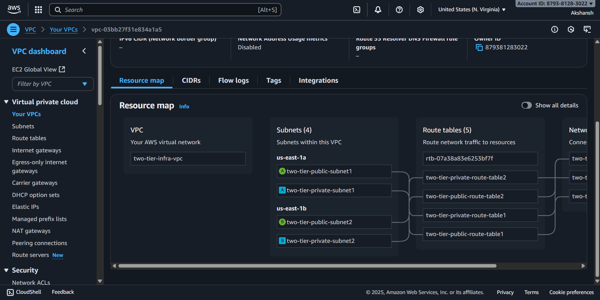
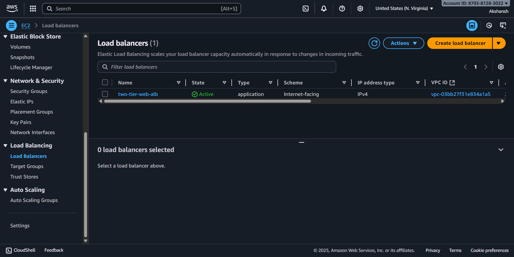

# 2-Tier AWS Infrastructure with Terraform

[](https://www.terraform.io/)
[](https://aws.amazon.com/)

## Table of Contents

- [Project Overview](#project-overview)
- [Architecture](#architecture)
- [Prerequisites](#prerequisites)
- [Implementation](#implementation)
- [Usage](#usage)
- [Screenshots](#screenshots)
- [Learning Outcomes](#learning-outcomes)
- [Contributing](#contributing)
- [License](#license)

## Project Overview

This project demonstrates the implementation of a robust 2-tier AWS infrastructure using Terraform as Infrastructure as Code (IaC). The architecture separates the web tier (presentation layer) from the database tier (data layer), providing a scalable, secure, and maintainable cloud solution.

The infrastructure is designed to host web applications with high availability, automatic scaling, and secure database connectivity. All resources are provisioned and managed through Terraform, ensuring consistent deployments and easy infrastructure management.

## Architecture

### Architecture Diagram

```
┌─────────────────┐    ┌─────────────────┐
│   Internet      │    │   Internet      │
│   Gateway       │    │   Gateway       │
└─────────────────┘    └─────────────────┘
         │                       │
┌─────────────────────────────────────────┐
│              Public Subnets              │
│  ┌─────────────┐    ┌─────────────┐    │
│  │ Application │    │ Application │    │
│  │Load Balancer│    │Load Balancer│    │
│  └─────────────┘    └─────────────┘    │
└─────────────────────────────────────────┘
         │                       │
┌─────────────────────────────────────────┐
│             Private Subnets              │
│  ┌─────────────┐    ┌─────────────┐    │
│  │   Web Tier  │    │   Web Tier  │    │
│  │ EC2 Instance│    │ EC2 Instance│    │
│  └─────────────┘    └─────────────┘    │
└─────────────────────────────────────────┘
         │                       │
┌─────────────────────────────────────────┐
│           Database Subnets               │
│  ┌─────────────┐    ┌─────────────┐    │
│  │  Database   │    │  Database   │    │
│  │   Tier      │    │   Tier      │    │
│  │   (RDS)     │    │ (Standby)   │    │
│  └─────────────┘    └─────────────┘    │
└─────────────────────────────────────────┘
```

### Components

**Web Tier (Public Layer):**

- Application Load Balancer (ALB) for traffic distribution
- Auto Scaling Group for EC2 instances
- EC2 instances hosting the web application
- Security Groups for controlled access

**Database Tier (Private Layer):**

- Amazon RDS (MySQL/PostgreSQL) with Multi-AZ deployment
- Database subnet groups across multiple AZs
- Security Groups restricting access to web tier only

**Supporting Infrastructure:**

- VPC with public and private subnets
- Internet Gateway for public internet access
- NAT Gateway for outbound internet access from private subnets
- Route tables for proper traffic routing
- CloudWatch metric alarms

## Prerequisites

Before you begin, ensure you have the following installed and configured:

- [Terraform](https://www.terraform.io/) (v1.0+)
- [AWS CLI](https://aws.amazon.com/cli/) configured with appropriate credentials
- An AWS account with necessary permissions
- Basic understanding of AWS services and Terraform

### AWS Permissions Required

- EC2 Full Access
- VPC Full Access
- RDS Full Access
- IAM permissions for resource creation

## Implementation

### Key Features Implemented:

- **VPC Configuration**: Custom VPC with CIDR block and DNS resolution enabled
- **Subnet Architecture**: Public subnets for load balancer, private subnets for web servers, database subnets for RDS
- **High Availability**: Multi-AZ deployment across different availability zones
- **Load Balancing**: Application Load Balancer with health checks and auto-scaling integration
- **Auto Scaling**: Auto Scaling Group with launch templates for dynamic scaling
- **Database Setup**: RDS instance with automated backups and security group restrictions
- **Security Implementation**: Security groups with least privilege access principles
- **Network Routing**: Proper route tables for public and private subnet traffic
- **NAT Gateway**: Outbound internet connectivity for private instances
- **Resource Tagging**: Consistent tagging strategy for resource management

### Directory Structure:

```
2-Tier-AWS-Infrastructure-Terraform
│   .gitignore
│   .terraform.lock.hcl
│   backend.tf
│   main.tf
│   README.md
│   variables.tf
│   variables.tfvars
│
└───modules
    ├───aws-alb
    │       gather.tf
    │       main.tf
    │       variables.tf
    │
    ├───aws-auto-scaling
    │       deploy.sh
    │       gather.tf
    │       main.tf
    │       variables.tf
    │
    ├───aws-iam
    │       iam-instance-profile.tf
    │       iam-policy.json
    │       iam-policy.tf
    │       iam-role.json
    │       iam-role.tf
    │       variables.tf
    │
    ├───aws-rds
    │       gather.tf
    │       main.tf
    │       variables.tf
    │
    ├───aws-sg
    │       gather.tf
    │       main.tf
    │       variables.tf
    │
    └───aws-vpc
            main.tf
            variables.tf
```

## Usage

### 1. Clone the Repository

```bash
git clone https://github.com/Akshansh029/2-Tier-AWS-Infrastructure-Terraform.git
cd 2-Tier-AWS-Infrastructure-Terraform
```

### 2. Configure Variables

Create a `variables.tfvars` file with your specific values:

### 3. Initialize Terraform

```bash
terraform init
```

### 4. Plan the Deployment

```bash
terraform plan -var-file=variables.tfvars
```

### 5. Apply the Configuration

```bash
terraform apply -var-file=variables.tfvars
```

### 6. Destroy Resources (when needed)

```bash
terraform destroy -var-file=variables.tfvars
```

## Screenshots

### Instances


### VPC and Networking



### Load Balancer Configuration



### Auto Scaling Group


### RDS Database


### CloudWatch


## Learning Outcomes

### Technical Skills:

- **Infrastructure as Code (IaC)**: Understanding Terraform syntax, modules, and best practices
- **AWS Networking**: VPC design, subnetting, routing, and security group configuration
- **High Availability Design**: Multi-AZ deployments and fault-tolerant architecture patterns
- **Load Balancing**: Application Load Balancer configuration and health checks
- **Auto Scaling**: Dynamic scaling policies and launch template management
- **Database Management**: RDS setup, security, and backup strategies

### DevOps Practices:

- **Version Control**: Managing infrastructure code in Git repositories
- **Environment Management**: Separating configurations for different environments
- **Resource Tagging**: Implementing consistent tagging strategies for cost management
- **Security Best Practices**: Implementing least privilege access and network segmentation
- **Monitoring and Logging**: Understanding CloudWatch integration and monitoring strategies

### AWS Services Mastery:

- Virtual Private Cloud (VPC) and networking components
- Elastic Compute Cloud (EC2) and Auto Scaling Groups
- Relational Database Service (RDS) configuration and management
- Application Load Balancer (ALB) setup and configuration
- Internet Gateway and NAT Gateway functionality
- Security Groups and Network ACLs

### Architecture Principles:

- **Separation of Concerns**: Understanding tier-based architecture design
- **Scalability**: Designing for horizontal and vertical scaling
- **Security**: Implementing defense in depth strategies
- **Cost Optimization**: Resource sizing and cost-effective deployment strategies
- **Disaster Recovery**: Multi-AZ deployment and backup strategies

## Contributing

Contributions are welcome! Please feel free to submit a Pull Request. For major changes, please open an issue first to discuss what you would like to change.

1. Fork the Project
2. Create your Feature Branch (`git checkout -b feature/AmazingFeature`)
3. Commit your Changes (`git commit -m 'Add some AmazingFeature'`)
4. Push to the Branch (`git push origin feature/AmazingFeature`)
5. Open a Pull Request

---

**⭐ If you found this project helpful, please give it a star!**
